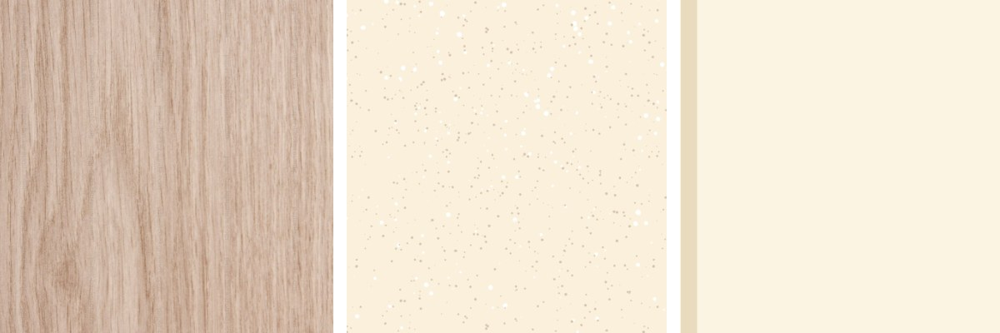
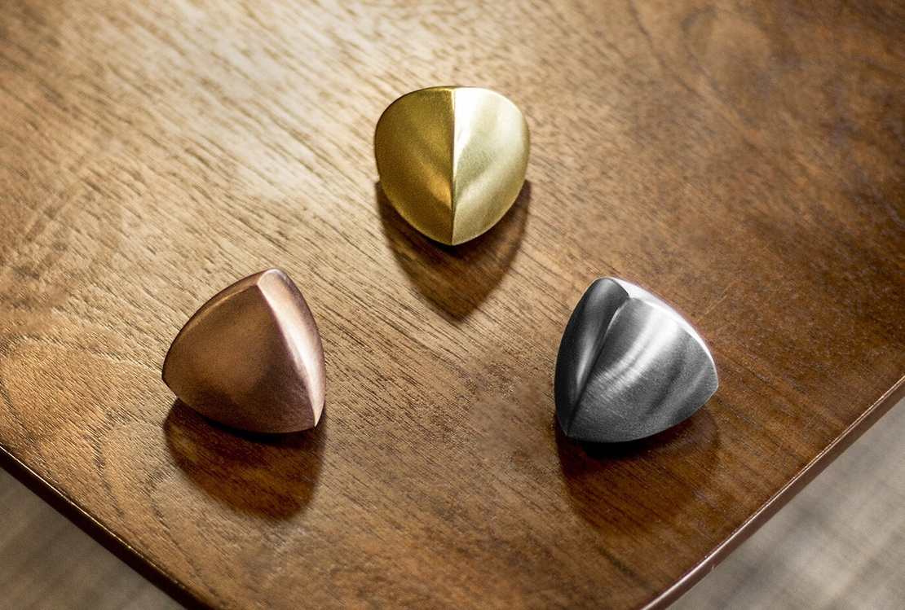
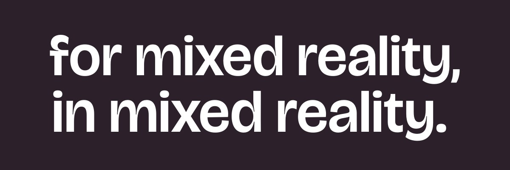
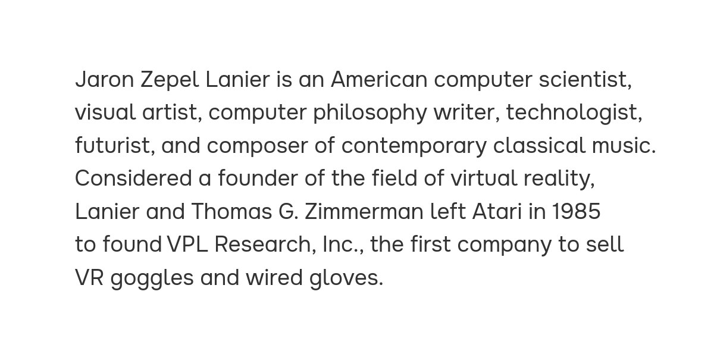

# Branding intro

Hey there! Laurent writing.

A lot of background stuff is happening this week. We are still hiring, we're looking for an office space, and Michael is making more progress on MR.js.

As promised, I would love to dive into the brand. I will try to walk you through the process while showcasing the brand we have created so far.

## Brand attributes

Branding involves many things: a logo, a set of colors, fonts, textures, shapes, animations, tone of voice, and more.

But before deciding on *any* of this, you have to ask yourself what you want your brand to stand for and what values you want it to communicate.

Here is a useful exercise: imagine your brand as a person who just entered the room. Who are they? What is their demeanor? Their attitude, their style?

This first step is called brand attributes: a set of qualities that you are willing to display and defend. Here are Volumetrics'

<fieldset><legend>Authentic</legend><ul>
    <li>Honest</li>
    <li>Ethical</li>
    <li>Wholesome</li>
</ul></fieldset>
<fieldset><legend>Resilient</legend><ul>
    <li>Timeless</li>
    <li>Stable</li>
    <li>Standard</li>
</ul></fieldset>
<fieldset><legend>Deliberate</legend><ul>
    <li>Thoughtful</li>
    <li>Opinionated</li>
    <li>Measured</li>
</ul></fieldset>

Following are some examples of those attributes, translate into real actions.

**Authentic**: We communicate in public. We share the first draft, because we thrive on the input of others. I (Laurent) am currently writing this, and you will hear many different voices, as we grow.

**Resilient**: This one is more of a technical one. We build software that will last; we avoid dependencies and follow open standards. We aim for websites and apps built in MR.js to work for a long time.

**Deliberate**: The “spatial computing” era has just begun, and a lot still has to be explored, especially on the web. Our promise is to be thoughtful and deliberate in all our decisions.

## Then what?

Now that we've described who we are as a company, it’s time to think visually.

At Volumetrics, we want to put reality back into mixed reality. We celebrate it and augment it. We are all about bringing magical digital objects into the real world. As such, I wanted to materialize the two faces of the brand that come into play: the real world and the magic, the augmented.

## Colors and textures

First, we have the foundation, anchored in reality. This is what’s outside the digital world: the sky, the light, the tables, and anything you see in pass-through.

Natural textures were the obvious inspiration here: wood,  specks, warm tones. I took inspiration from print media too: the esthetic of furniture catalogs with their columns, captions, asides and full-page photos.

Then, there are the magical things you can conjure when you put the headset on. Colorful, animated, light-emitting digital objects, blissfully ignoring the law of physics.

Together, I find this contrast very interesting. Let me know your thoughts if any of this makes any sense to you!

## Shape of the logo

With a name like Volumetrics, we wanted a logo that had a physicality to it. But we also wanted our logo to be sophisticated. Something special, complex, and technical. A plus was obviously something triangular because, you know, Volumetrics.

When we stumbled upon this shape, we both fell in love with it. It is called a [Spheroform with tetrahedral symmetry](https://www.xtalgrafix.com/Spheroform2.htm). Here is a great [YouTube video](https://www.youtube.com/watch?v=fOojOfpcPZM) about it.

In short, this is a fascinating shape. It has a rhythm. It’s sophisticated and has a perfect tension between smooth faces and sharp edges.

## Typography  

Usually, brands use two fonts: one for titles and one for the body text.
It is so for a simple reason: what makes text readable in small sizes (simpler shapes, added space, wider letters) is also what makes it look bad in large sizes. Using two fonts allows you to keep your body text super readable while offering something interesting to look at when the text is large.

For the header text, we picked [Bricolage Grotesque](https://ateliertriay.github.io/bricolage/). It felt like the right mix of modern and wholesome. A nod to print (those [ink traps](https://en.wikipedia.org/wiki/Ink_trap)!) in the era of the metaverse.

For the body text, we picked [Onest](https://onest.md/), which is Romanian for "honest" (brand serendipity right here). There is a certain roundness and openness to it that just felt right for us. Most of all, it is very readable.

## Next steps

While this is far from a final brand, we think this is a good foundation to build upon. Any questions, comments, or ideas? Please don't hesitate to respond directly to this email, or tag us on Mastodon!

Until next time,  
Laurent
