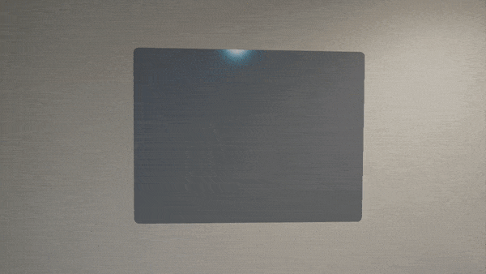
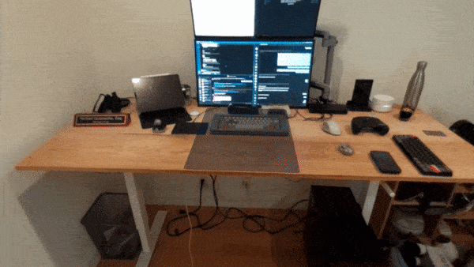
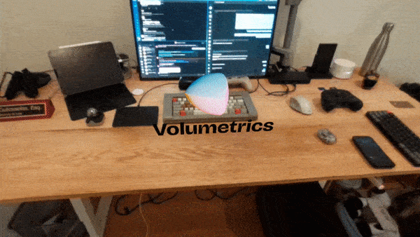
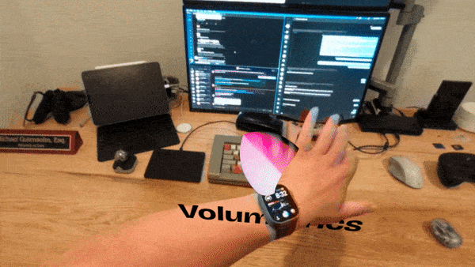

# Picking up speed

Michael and Laurent here. Thanks for subscribing to our newsletter!

## We got funded!

We’ve officially raised $1.1 million in seed funding from Abstract Ventures & Alt Capital. We chose to go with Abstract & Alt Cap as they believe in our vision and share our passion for the future of the web.

We’ll be using this funding to pursue our vision of a Spatial design and development platform where designers and developers of all types can build for mixed reality, in mixed reality.

You can [read more in our press release](/posts/we-raised-money/).

## We’re hiring.

Now that we can pay people, we’re diving right into looking for a great founding engineer. We’ve already got a few candidates in the pipeline, but please don't hesitate to share [the post](/careers/) with anyone you might think is a good fit.

## MR.js update

*Surfaces, responsive layout, text, models, lighting and more*

Michael here!  
In between closing our first round and interviewing, I did manage to write some code and implement some key features in MR.js.

### Surfaces

Core to our mixed-reality-first approach is the concept of contextualization. Part of why phones, tablets, and desktops are so great is that you know where to look. This isn’t always the case for XR content. Many experiences will place content all around you, or someplace you’re not expecting. As a result, people will find themselves looking all around, craning their necks, and trying to find things. This can quickly lead to fatigue.

Using the `mr-surface` tag, you enable your users to choose where the content is placed, much like when they choose where to place their laptop or phone.

Surfaces can be anchored to walls

And to horizontal surfaces such as a desk or table

### Models, lighting, and a custom system

I've also added support for models via the `mr-model` tag, and lights via the `mr-light` tag. Here’s an example using our logo: it's loading an STL, but we’ll be integrating support for all major file types as we go.

You’ll also notice the rotation of both the lights and the model itself. I don’t have a full implementation of animations quite yet, so I've implemented a simple rotation animation by utilizing custom systems and components. You can view the code [here](https://github.com/Volumetrics-io/MR.js/blob/main/dist/assets/js/AnimationSystem.js).

### Hand matting & shadows

By playing with render order, I was able to achieve a very rudimentary form of hand matting. This helps maintain the illusion that the virtual content is in your space. It isn’t perfect, but combined with shadows, it can be very convincing.

That’s all for this week! Check out the [full demo on Youtube](https://youtu.be/2LrY2fIslJw), and check [github](https://github.com/Volumetrics-io/MR.js/tree/main) for the latest updates.

<a class="button cta" href="https://youtu.be/2LrY2fIslJw">Watch on YouTube</a>

til next time,

Michael and Laurent
